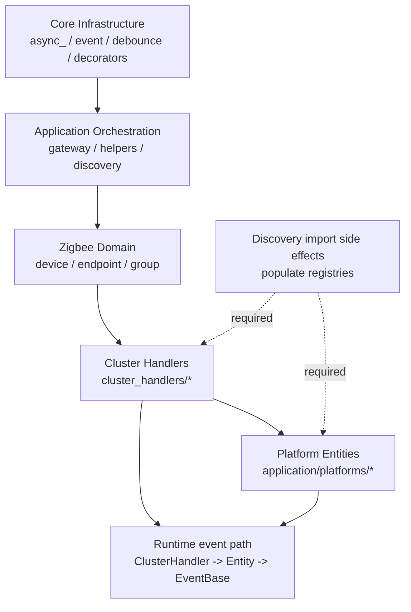

# System Map

This document maps ZHA runtime layers, their responsibilities, and major entry points.

## Layered Architecture

## 1) Core Infrastructure Layer

Primary files:

- `zha/async_.py`
- `zha/event.py`
- `zha/debounce.py`
- `zha/decorators.py`

Responsibilities:

- Async task lifecycle management and cancellation (`AsyncUtilMixin`).
- Event subscription and dispatch (`EventBase`).
- Debounced execution for timing-sensitive operations.
- Generic registries and decorators used by higher layers.

## 2) Application Orchestration Layer

Primary files:

- `zha/application/gateway.py`
- `zha/application/helpers.py`
- `zha/application/discovery.py`

Responsibilities:

- Start/stop the Zigbee controller and coordinate runtime lifecycle.
- Manage join/leave/initialization events and global background jobs.
- Discover entities for devices, endpoints, and groups.

Key symbols:

- `Gateway`
- `async_from_config`
- `_async_initialize`
- `load_devices`
- `async_initialize_devices_and_entities`
- `discover_device_entities`

## 3) Zigbee Domain Layer

Primary files:

- `zha/zigbee/device.py`
- `zha/zigbee/endpoint.py`
- `zha/zigbee/group.py`

Responsibilities:

- Represent Zigbee devices/endpoints/groups in ZHA domain terms.
- Wire endpoints to cluster handlers and drive device initialization.
- Maintain group membership and group-level entity behavior.

Key symbols:

- `Device`
- `Endpoint`
- `Group`

## 4) Cluster Handler Layer

Primary files:

- `zha/zigbee/cluster_handlers/__init__.py`
- `zha/zigbee/cluster_handlers/registries.py`
- `zha/zigbee/cluster_handlers/manufacturerspecific.py`

Responsibilities:

- Adapt zigpy clusters to ZHA-specific behavior.
- Bind/reporting setup and attribute update handling.
- Registration and lookup for handler selection.

Key symbols:

- `ClusterHandler`
- `ClientClusterHandler`
- `CLUSTER_HANDLER_REGISTRY`
- `BINDABLE_CLUSTERS`

## 5) Platform Entity Layer

Primary files:

- `zha/application/platforms/__init__.py`
- `zha/application/platforms/*`

Responsibilities:

- Define the entity model and platform abstractions.
- Register entities and group entities into discovery registries.
- Bridge cluster-handler state changes to entity state events.

Key symbols:

- `BaseEntity`
- `PlatformEntity`
- `GroupEntity`
- `ENTITY_REGISTRY`
- `GROUP_ENTITY_REGISTRY`
- `register_entity`

## Dependency Direction

Expected direction for most imports:

`Core Infrastructure -> Application Orchestration -> Zigbee Domain -> Cluster Handlers / Platform Entities`

Important exception:

- Discovery intentionally imports many platform and cluster-handler modules for registration side effects.
- Refactors must preserve registration timing and import coverage.

## High-Impact Files for Large Refactors

- `zha/zigbee/device.py` (device lifecycle and entity-discovery trigger points)
- `zha/application/discovery.py` (entity selection and arbitration)
- `zha/application/platforms/__init__.py` (registry contracts)
- `zha/application/gateway.py` (global orchestration and event gateways)
- `zha/zigbee/cluster_handlers/__init__.py` (cluster event handling contracts)
